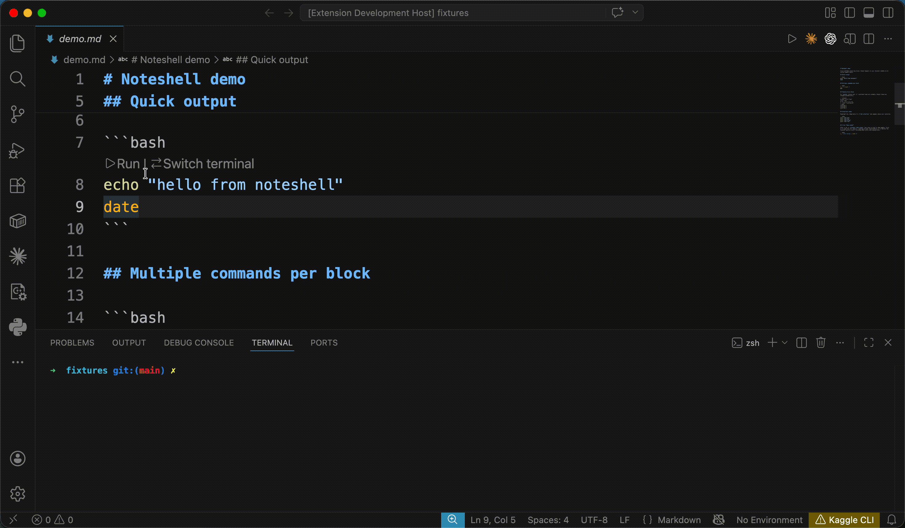

# Noteshell

Run bash snippets inline (from markdown, `.sh` scripts, and marker-prefixed comments) in existing terminals so environment, `cd` state, and history stay intact.



## What it does

- **Markdown**: every ```` ```bash ```` / ```` ```sh ```` / ```` ```shell ```` / ```` ```console ```` block gets a `▶ Run` CodeLens. In `console` blocks only `$ `-prefixed lines are runnable; `> ` continuation lines fold into the same command.
- **`.sh` files**: one `▶ Run` above each blank-line-separated logical block.
- **Selection**: highlight any range in a `.sh` file or inside a shell-fenced markdown block → `▶ Run selection` lens appears above it.
- **Comments in other languages**: marker-required. Comment lines starting with `$ ` or `run:` become runnable (e.g. `# $ curl …`, `// run: npm test`). Enabled by default for common dev languages, gated on the language having a user-installed extension.

Each Run lens has a `↻ Switch terminal` sibling. Click it to re-pick the terminal for the file without running.

Click `▶ Run` → QuickPick lists active terminals + `＋ New terminal` → command runs there. Output is captured via VSCode's Shell Integration API. An inline summary appears below:

```
✓ exit 0 · 340ms
```

A `$(output) Show output` lens appears next to *Run again*. Click it to open the full captured output, rendered through [`@xterm/headless`](https://npmjs.com/package/@xterm/headless) (the same emulator VSCode uses internally) so the result matches the terminal byte-for-byte, including carriage-return progress bars, OSC markers, and color codes.

Two viewers:

- **`log`** (default): read-only document, plain text.
- **`terminal`**: webview with ANSI colors preserved.

## Settings

| Setting | Default | Notes |
| --- | --- | --- |
| `noteshell.markdownLanguages` | `["bash","sh","shell","console"]` | Fenced block languages in `.md` that get a Run button. |
| `noteshell.commentScanLanguages` | `["python","javascript","typescript","javascriptreact","typescriptreact","go","rust","ruby","dockerfile","makefile","yaml","toml"]` | Languages where `# $ …` / `// run: …` marker comments become runnable. Takes effect live. Set to `[]` to disable. |
| `noteshell.commentScanRequiresInstalledLanguage` | `true` | Only scan a language when a user-installed extension contributes it. Blocks scanning when only the built-in VSCode grammar is present (e.g. opening a `.go` file with no Go extension). |
| `noteshell.shellScriptCodeLens` | `"perBlock"` | `off` / `fileOnly` / `perBlock`. Run-button density in `.sh` files. |
| `noteshell.outputViewer` | `"log"` | `log` = readonly document; `terminal` = webview with ANSI colors. |
| `noteshell.ansiInOutput` | `"strip"` | `strip` runs output through `@xterm/headless` for a terminal-accurate clean view. `preserve` keeps raw ANSI. |
| `noteshell.confirmBeforeRun` | `"untrusted"` | `always` / `untrusted` / `never`. When a modal confirmation appears. |
| `noteshell.rememberTerminalPerFile` | `true` | Reuse the last-picked terminal per file. |
| `noteshell.outputCapBytes` | `2000000` | Maximum captured-output bytes before truncation. |

Three theme colors are also exposed: `noteshell.successForeground`, `noteshell.errorForeground`, `noteshell.runningForeground`. Override via `workbench.colorCustomizations`.

## Commands

| Command | Notes |
| --- | --- |
| `Noteshell: Run Selection` | Runs the current editor selection verbatim. |
| `Noteshell: Pick Terminal for File` | Pre-select / change the terminal for the current file without running. |
| `Noteshell: Show Full Output` | Opens the full captured output for a snippet (usually triggered via the `Show output` lens). |
| `Noteshell: Clear Results` | Wipes inline summaries for the session. |

## Requirements

- **VSCode 1.99.0+**: needed for reliable `TerminalShellIntegration.executeCommand` across sub-executions.
- **Shell integration enabled** (`terminal.integrated.shellIntegration.enabled`, on by default) with a supported shell (bash / zsh / fish / pwsh). Without it, the extension falls back to `sendText`: the command runs but output and exit code are not captured (summary shows `▶ sent to terminal`).
- **Workspace Trust**: runs are blocked in untrusted workspaces until trust is granted. `confirmBeforeRun` adds an optional modal step.

## Development

```bash
npm install
npm run compile       # type-check + esbuild bundle to dist/
npm run watch         # watch mode
```

Open the folder in VSCode and press **F5** to launch an Extension Development Host with `test/fixtures/` preloaded.

Packaging and publishing:

```bash
npm run vsix                  # builds noteshell-<version>.vsix
npm run publish:marketplace   # vsce publish (requires publisher PAT)
```

## Known limitations

- `console` fenced-block prompts recognize `$ ` and `> ` only. `%` (fish) and `PS>` (pwsh) are not detected.
- Concurrent runs on the same terminal are serialized (second snippet shows `⏳ Queued` until the first finishes). Different terminals run concurrently.
- Some zsh plugins disable shell integration mid-session, and the affected terminal then falls back to `▶ sent to terminal`.

## Roadmap

- **Zed port**: parsers (`src/parsers/*`) are VSCode-free and portable; the port will land once Zed's extension API gains CodeLens and terminal-capture equivalents.
- More prompt dialects in `console` blocks (`%`, `PS>`, custom).
- Named blocks in markdown for cross-block references.

## License

MIT. See [LICENSE](./LICENSE).
